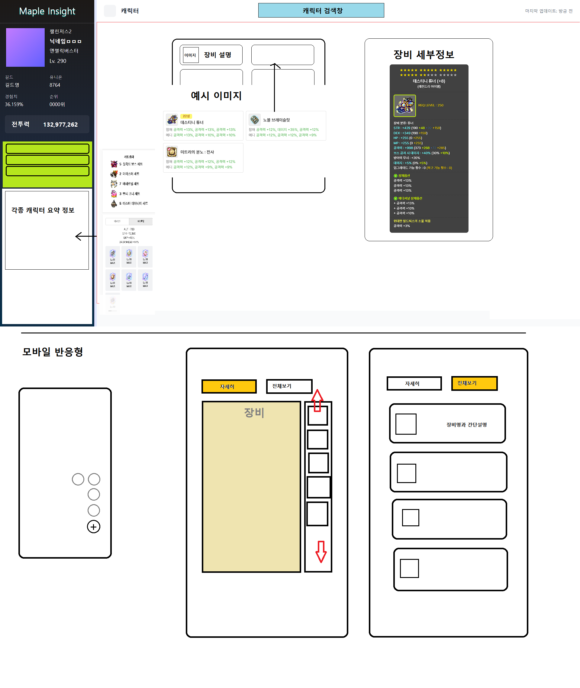

# dev-log (개발 일지)

<span style='font-style:italic; font-size:0.8rem; font-weight:200; color:magenta; text-decoration: none; pointer-events: none;'> Author - jo4086 <br /> Email &nbsp; - ghzktm5892@gmail.com</span>

## 25-07-12

### ts파일들의 별칭이 경로를 찾지 못하는 문제 해결

**관련 파일**:

- eslint.config.js: **speard**가 가능한 오브젝트들과 불가능한 **객체 배열 또는 스트링형**들이 다루는 key의 잘못된 설정으로 인한 오류로 `extends <- spread 가능 객체` / `rules <- spread 불가능 객체배열 및 문자열` 을 구분하고 중복된 선언들 및 관심사에 대해 정리를 하였음\
  (**global**, **front**, **back**, **package**, **ignore**)
- apps/front/tsconfig.json
- apps/front/tsconfig.app.json
- apps/front/vite.config.ts: `vite-tsconfig-paths`를 이용하여 `tsconfig.json`의 paths를 자동으로 인식하게 함

### 프론트 디자인 1차 설계(반응형 모바일 고려) 및 전체적인 아키텍처 구상



# 전체적인 사이트의 디자인 구조의 틀 구상, 모바일에서의 사용자 경험을 고려한 이중 디자인 고려,

**모바일**:

모바일은 특성상 엄지손가락의 가동범위에 주요기능들이 작동되게 하는게 중요하다. 모바일 기기는 자체만으로 한눈에 들어오기 때문에 시선은 위에서 아래로 흐르며 이를 조작하는것이 엄지손가락이 주가 되기 때문이다.

그러므로 하단 푸터와 우측하단의 액션버튼 둘 중 하나를 아직 고민중이다.

중요한 장비창의 사용에 대해서는 우측에 수직 장비 스크롤 구조를 도입하여 엄지로 쉽게 드래그함으로써 장비의 교체및 순환을 하고 가운데에 장비 정보를 업데이트함으로써 편리함을 추구했다.

그리고 전체적인 정보를 간략하게 보고싶은 상황을 고려하여 상단에 `전체보기`, `자세히보기` 2개의 탭을 두어 2가지 버전을 손쉽게 스위칭하며 정보를 제공하고자 한다.

**데스크탑**

# 전체적인 간략하지만 보고싶은 정보들은 사이드바에 개인정보를 넣음으로써 가운데 화면을 넓히는 전략을 사용하였다.

사이드바의 숨김처리로 더 넓은 화면도 볼 수 있으며 이는 해당 사이트의 핵심 기능인 시뮬레이터를 보기 편하게 하기 위해서 채택한 구조다.

많은 정보들이 좁은 공간에 모여있으면 사용자는 눈의피로와 너무많은 정보를 한번에 받아들이게 되므로 혼란을 느끼게 될 것이라 생각하였다.

그리고 성능상의 이점도 동시에 챙길 수 있을거이라 생각한다. 왜냐하면 큼직하게 보여준다는건 한번에 보는 정보량이 적게되므로 해당 데이터를 우선해서 렌더링하고 나머지는 레이지로드로 천천히 가져옴으로써 더 빠른 웹 사이트의 경험을 제공할 수 있을거이라 생각하였다.

이는 아직 실제적으로 구현해본적이 없는 이론만 아는 상태이므로 여러번의 시행착오가 동반 될 것 같다.

이 외에도 생각한 서버와 프론트의 구조는 많지만 아직 서술할 만큼 정리가 되지 않은 부분이므로 매일생각하며 하나의 모듈적인 아이디어로 정리가 끝나면 계속해서 해당 구조에 대해 올릴것이다.

**서버**

서버는 생각하기로 가장 바쁘고 부하가 클 핵심적인 장소로 예상된다. 프론트에는 로그인 기능이 존재하지 않으며 시뮬레이터라는 특성산 백엔드의 활발한 계산이 필수적이다. 또한 게임 시뮬레이터는 굉장히 다양한 변수들을 다루기에 이를 얼마나 추상화를 잘 해놓으며 캐시데이터와 가비지정리를 얼마나 최적화 하느냐가 중요할 것이다.

서버는 도메인 중심 구조로 설계를 했으며 이를 위해 캐시구조를 자동으로 최적화하고 정리하며 실수를 방지하기 위해 매우 초기단계에 이에대한 타입을 생성하고 관리하는 스크립트를 미리 고안해두었다.

아직 어떻게 사용될 지는 미지수지만 개발에 많은 편의성을 줄 것이라 생각한다.

**패키지**

해당 프로젝트를 모노레포로 구성하게된 가장 큰 이유가 되는 부분이다.\
프로젝트의 특성상 프론트와 백엔드는 게임의 스탯과 장비, 직업, 닉네임, 도감등등 수많은 데이터들을 같이 다룬다. 정확히는 프론트가 보여줄 데이터의 종류가 매우 많은데 해당 데이터 종류들이 프론트에서가공된것이 아닌 이미 백엔드에서 가공해서 보내주는 동일한 이름을 쓰는 점이 핵심이다.\
그러므로 이에 대해 혼란을 줄이고 일관된 구조를 갖게 하기 위해 _TypeScript_ 의 **타입**을 공유해야 한다고 생각하였고 이를 모노레포의 공통타입 패키지로 구분하여 의존성을 갖게함으로써 손쉽게 다루게 설계하였다. 이는 이론만 생각해서 만든 구조이므로 실제로 어떻게 작용할지는 미지수이나 아마 꽤나 도움이 되지 않을까한다.

## 2025-07-13

### re-export 구조 도입

`keyword: #reexport #snippet #nvim #productivity`

```tsx
import React from 'react';
import cn from 'classnames';
```

### thinking

위와 같이 자주 사용되는 import인 코드를 파일마다 반복적으로 작성하거나 붙여넣기에는 불편하다고 생각하였다\
이에 대해 어떻게하면 이런 사소한 작업을 안정적이게 수행하면서 속도를 가할 수 있을까 찾아보았고\
**re-export**라는 커스텀 import 기능과 내가 사용하는 에디터인 nvim의 **snippets**를 결합한 방법을 찾게되었다.

### code

<details>
<summary>펼치기/접기</summary>

**re-export.ts 파일**

```ts
// src/shared/re-export.ts
import * as React from 'react';
import classNames from 'classnames';

const cn = classNames;

export { React, cn };
```

**사용방법**

```tsx
// 사용 컴포넌트
// call 입력시 자동완성
import { React, cn } from '@/shared';
```

</details>

### result

사용결과 작지만 생산력을 증가시켰으며 다양하게 바리에이션한 **re-export**를 적절하게 사용하게 된다면\
점점 누적되어 유의미한 수치가 되지 않을까 생각한다.\
이런 기술의 사용은 계속해서 고민하고 적용해보면서 경험을 늘려 적재적소에 사용할 수 있는 감각을 키우는 것이 중요할 것이다.

## 2025-07-17

### 백엔드 주도 역수출 타입 파이프라인 설계

_keyword: #CI_CD #pipeline #reverse_dependency #DDD #architecture #automation_types #type_sync ._

### thinking

`type WarriorCategory = 'hero' | 'paladin' | 'darkNight' | ...`

직업군과 직업군에 속하는 직업명의 타입을 생성하고 관리하기 위해 공통 패키지에 직업 코드를 위와같이 추가하다가 이를 자동화 할 수 있을것같다는 생각이 들었다.\
그러기 위해서는 데이터를 실속적으록 분리하면서 쓸 수 있는 디렉토리명 기반 생성을 도입하려고 하였으나, 이 구조는 백엔드가 잘 활용할 수 있는 구조이며\
공통패키지에서 이런 자동화 및 안정성을 위해서 디렉토리를 만드는건 매우 복잡해지고 비효율적이라는 생각이 들었다.\

그래서 반대로 생각하였다. 이런경우는 백엔드에서 디렉토리기반 타입을 생성해서 역으로 생성한 타입을 공통패키지에 주입함으로써\
프론트입장에서는 공통패키지에서 이미 정의된 타입을 쓰는 공통패키지로써의 역할을 하면서\
이와 직결되는 수많은 데이터를 다루는 백엔드가 업데이트하고 자동화 한다면 공통 패키지는 타입의 허브로써 여전히 가벼운 구조를 지니며\
핵심 로직들을 가지는 백엔드는 효율적인 디렉토리구조로 관리하면서 타입까지 스스로 생성하고 동기화하는 구조가 되므로 꼭 패키지가 주도하지 않아도 괜찮을 것 같다는 생각이 들게 되었다.\

이를 위해 백엔드 기반 타입생성 => 공통패키지에 역수출 동기화 => 프론트의 import 구조를 설계해보고자 한다.
